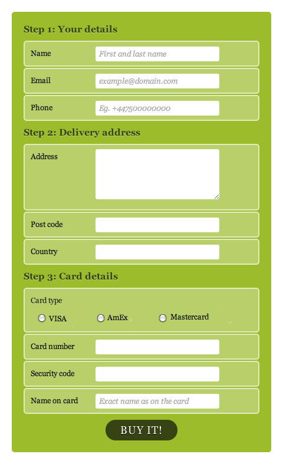

# Lab-to-be-named

## Description
You will pair program with a partner to complete this assignemnt. One partner, the driver, should share their screen and be the one typing. The other partner, the observer, should review each line of code. Both partners should be cooperating when solving problems. When an objective has been met, the driver should push the code to the GitHub account, the observer should pull the changes, and the two partners switch roles. 

## Steps
1. The page should have a section for gathering user contact info
2. The page should have a section for gathering address info
3. The page should have a section for gathering credit card info and a submit button
4. The page should have the correct coloring
5. The page should have the correct border styling
6. The page should have the correct spacing

## Mock Up

